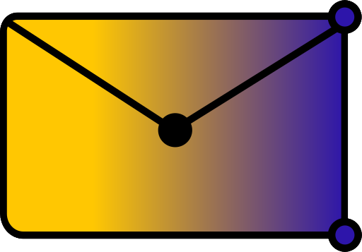

#  PostGraph - SMTP to Microsoft Graph API proxy

PostGraph is a simple tool that acts as a proxy between legacy SMTP clients and the Microsoft Graph API.
it allows you to send mails via Microsoft Graph API using any SMTP client.

## Usage

Please refer to the [wiki](https://github.com/shadow578/PostGraph-rs/wiki) for detailed setup and usage instructions.

## License

this project is licensed under the GNU General Public License v3.0 - see the [LICENSE](LICENSE) file for details.   
   

that means that you are free to use, modify and redistribute this software, but you must also distribute your modifications under the same license.
this includes using this software in a commercial context, e.g. instaling it on a customers server.
while this license doesn't *strictly* require you to disclose the use of this software to your customers, it'd be really nice if you did.  

no liability is assumed for any damage caused by this software, and it is provided "as-is" without any warranty.

